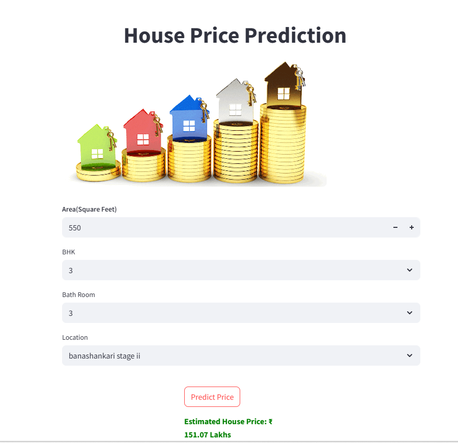

# House Price Prediction App

This is a machine learning-based web application that predicts house prices in Bengaluru, India. The project uses real-world housing data from Kaggle and walks through the full pipeline: data preprocessing, model training, serialization, and deployment using Streamlit.

## Features

- Uses Bengaluru House Price dataset from Kaggle
- Performs data cleaning, feature engineering, and model training
- Saves the trained model using pickle for reuse
- Provides an interactive Streamlit web application for predictions
- Simple interface to input property features like location, area, BHK, and bathrooms

# House Price Prediction App

This project is a **machine learning-powered web application** that predicts house prices in **Bengaluru, India**, using real-world data from Kaggle.

It covers the **end-to-end ML pipeline**, from data preprocessing to model training and finally deploying a Streamlit-based web app for predictions.

---

##  Features

- Built using the **Bengaluru House Price dataset** from Kaggle
- Data cleaning, feature engineering, and model training
- Model stored using `pickle` for easy reuse
- Interactive **Streamlit web app** to make predictions in real time
- Trained using `Linear Regression` (or mention if different)
- Simple UI to select inputs like location, BHK, square feet, etc.

  
 
>>>>>>> a3cc913fee9319f0f275ea23468808835d4a56b6
